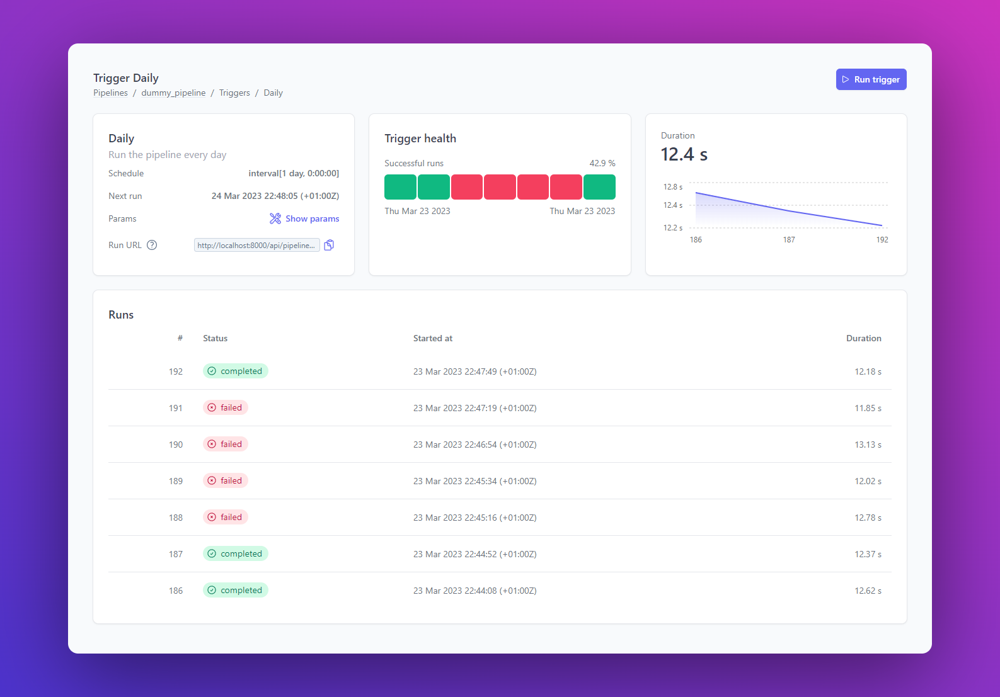
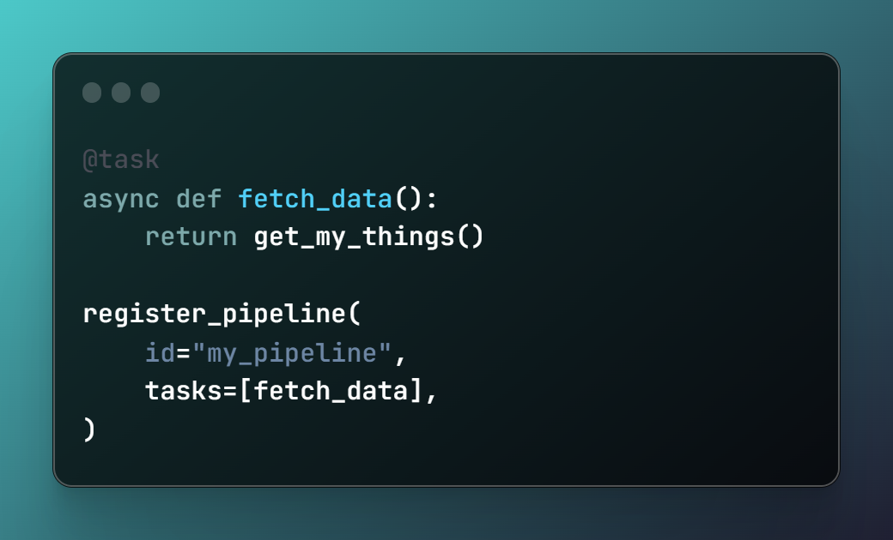

<!-- Improved compatibility of back to top link: See: https://github.com/othneildrew/Best-README-Template/pull/73 -->
<a name="readme-top"></a>


<!-- PROJECT SHIELDS -->
<!--
*** I'm using markdown "reference style" links for readability.
*** Reference links are enclosed in brackets [ ] instead of parentheses ( ).
*** See the bottom of this document for the declaration of the reference variables
*** for contributors-url, forks-url, etc. This is an optional, concise syntax you may use.
*** https://www.markdownguide.org/basic-syntax/#reference-style-links
-->
[![Contributors][contributors-shield]][contributors-url]
[![Forks][forks-shield]][forks-url]
[![Stargazers][stars-shield]][stars-url]
[![Issues][issues-shield]][issues-url]
[![MIT License][license-shield]][license-url]


<!-- PROJECT LOGO -->
<br />
<div align="center">
<h3 align="center">Plombery</h3>

  <p align="center">
    Python task scheduler with a user-friendly web UI
    <br />
    <a href="https://lucafaggianelli.github.io/plombery/"><strong>Official website »</strong></a>
    <br />
    <br />
    <a href="https://github.com/lucafaggianelli/plombery/issues">Report Bug</a>
    ·
    <a href="https://github.com/lucafaggianelli/plombery/issues">Request Feature</a>
  </p>
</div>


<!-- ABOUT THE PROJECT -->
## About The Project

Plombery is a simple task scheduler for Python with a web UI and a REST API,
if you need to run and monitor recurring python scripts then it's
the right tool for you!

<figure>
  
</figure>

> This project is at its beginning, so it can be shaped and improved with
  your feedback and help!
  If you like it, star it 🌟! If you want a feature or find a bug, open an issue.

## Features
* ⏰ Task scheduling based on [APScheduler](https://github.com/agronholm/apscheduler) (supports Interval, Cron and Date triggers)
* 💻 Built-in Web interface, no HTML/JS/CSS coding required
* 👩‍💻🐍 Pipelines and tasks are defined in pure Python
* 🎛️ Pipelines can be parametrized via [Pydantic](https://docs.pydantic.dev/)
* 👉 Pipelines can be run manually from the web UI
* 🔐 Secured via OAuth2
* 🔍 Debug each run exploring logs and output data
* 📩 Monitor the pipelines and get alerted if something goes wrong
* 💣 Use the REST API for advanced integrations

When you shouldn't use it:
- you need a lot of scalability and you want to run on a distributed system
- you want a no-code tool or you don't want to use Python

<p align="right">(<a href="#readme-top">back to top</a>)</p>


### Built With

* [![Python][Python]][Python-url]
* [![TypeScript][TypeScript]][TypeScript-url]
* [![React][React.js]][React-url]

<p align="right">(<a href="#readme-top">back to top</a>)</p>

<!-- GETTING STARTED -->
## 🚀 Getting Started

Check the 👉 [official website](https://lucafaggianelli.github.io/plombery/)

## 🧐 Show me the code

This is how it looks a minimalist pipeline:

<figure>
  
  <figcaption>I know you want to see it!</figcaption>
</figure>

<!-- ROADMAP -->
## 🛣 Roadmap

See the [open issues](https://github.com/lucafaggianelli/plombery/issues) for a full list of proposed features (and known issues).

<p align="right">(<a href="#readme-top">back to top</a>)</p>


<!-- CONTRIBUTING -->
## 👩‍💻 Contributing

Contributions are what make the open source community such an amazing place to learn, inspire, and create. Any contributions you make are **greatly appreciated**.

If you have a suggestion that would make this better, please fork the repo and create a pull request. You can also simply open an issue with the tag "enhancement".
Don't forget to give the project a star! Thanks again!

1. Fork the Project
2. Create your Feature Branch (`git checkout -b feature/AmazingFeature`)
3. Commit your Changes (`git commit -m 'Add some AmazingFeature'`)
4. Push to the Branch (`git push origin feature/AmazingFeature`)
5. Open a Pull Request

<p align="right">(<a href="#readme-top">back to top</a>)</p>

### Development

Clone a fork of this repo and start your dev environment.

Create a python virtual environment:

```sh
python -m venv .venv
# on Mac/Linux
source .venv/bin/activate
# on Win
.venv/Script/activate
```

and install the dependencies:

```sh
pip install -r requirements.txt
pip install -r requirements-dev.txt
```

for development purposes, it's useful to run the example application:
```sh
cd examples/

# Create a venv for the example app
python -m venv .venv
source .venv/bin/activate
pip install -r requirements

./run.sh
# or ./run.ps1 on windows
```

The React frontend is in the `frontend/` folder, enter the folder
and install the dependencies:

```sh
cd frontend/
# The project uses yarn as dependency manager, if you don't have
# it, you must install it.
# This command will install the deps:
yarn
```

run the development server:

```sh
yarn dev
```

### Documentation

The documentation website is based on MkDocs Material, the source code is in the
`docs/` folder and the config is in the `mkdocs.yml` file.

To run a local dev server, run:

```
mkdocs serve
```

### Testing

Tests are based on `pytest`, to run the entire suite just run:

```sh
pytest
```

To run tests coverage, run:

```sh
coverage run -m pytest
coverage report -m
```

<!-- LICENSE -->
## License

Distributed under the MIT License. See `LICENSE.txt` for more information.

<p align="right">(<a href="#readme-top">back to top</a>)</p>


<!-- CONTACT -->
## Contact

Project Link: [https://github.com/lucafaggianelli/plombery](https://github.com/lucafaggianelli/plombery)

<p align="right">(<a href="#readme-top">back to top</a>)</p>


<!-- ACKNOWLEDGMENTS -->
## Acknowledgments

Plombery is built on top of amazing techs:

* [FastAPI](https://fastapi.tiangolo.com/)
* [Pydantic](https://docs.pydantic.dev/)
* [APScheduler](https://apscheduler.readthedocs.io/)
* [Apprise](https://github.com/caronc/apprise)
* [React](https://react.dev/)
* [Vite](https://vitejs.dev/)
* [Tremor](https://www.tremor.so/)

<p align="right">(<a href="#readme-top">back to top</a>)</p>


<!-- MARKDOWN LINKS & IMAGES -->
<!-- https://www.markdownguide.org/basic-syntax/#reference-style-links -->
[contributors-shield]: https://img.shields.io/github/contributors/lucafaggianelli/plombery.svg?style=for-the-badge
[contributors-url]: https://github.com/lucafaggianelli/plombery/graphs/contributors
[forks-shield]: https://img.shields.io/github/forks/lucafaggianelli/plombery.svg?style=for-the-badge
[forks-url]: https://github.com/lucafaggianelli/plombery/network/members
[stars-shield]: https://img.shields.io/github/stars/lucafaggianelli/plombery.svg?style=for-the-badge
[stars-url]: https://github.com/lucafaggianelli/plombery/stargazers
[issues-shield]: https://img.shields.io/github/issues/lucafaggianelli/plombery.svg?style=for-the-badge
[issues-url]: https://github.com/lucafaggianelli/plombery/issues
[license-shield]: https://img.shields.io/github/license/lucafaggianelli/plombery.svg?style=for-the-badge
[license-url]: https://github.com/lucafaggianelli/plombery/blob/master/LICENSE
[product-screenshot]: images/screenshot.png
[Next.js]: https://img.shields.io/badge/next.js-000000?style=for-the-badge&logo=nextdotjs&logoColor=white
[Next-url]: https://nextjs.org/
[React.js]: https://img.shields.io/badge/React-20232A?style=for-the-badge&logo=react&logoColor=61DAFB
[React-url]: https://reactjs.org/
[Python]: https://img.shields.io/badge/Python-3776AB?style=for-the-badge&logo=python&logoColor=yellow
[Python-url]: https://www.python.org/
[TypeScript]: https://img.shields.io/badge/TypeScript-007ACC?style=for-the-badge&logo=typescript&logoColor=white
[TypeScript-url]: https://www.typescriptlang.org/