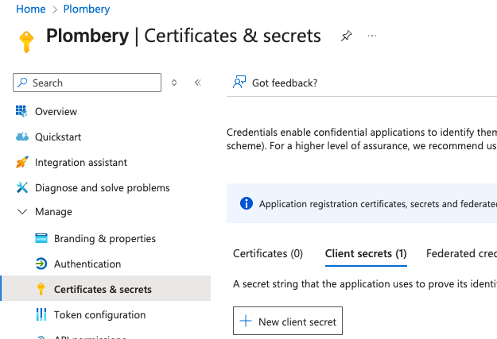

*Available from v0.5.0*

Microsoft authentication is supported out-of-the-box, you just need to register an App in your Azure portal and obtain a `client_id`, `client_secret` and optionally a `tenant_id`.

For a detailed guide on how to register the app on Azure, check the
section below.

## Configuration

This is the configuration needed
in `plombery.config.yaml`:

```yaml title="plombery.config.yaml"
auth:
  provider: microsoft
  client_id: $MICROSOFT_CLIENT_ID
  client_secret: $MICROSOFT_CLIENT_SECRET
  microsoft_tenant_id: $MICROSOFT_TENANT_ID
```

The values starting with `$` are replaced with environmental variables, in this way secret values
are decoupled from the configuration file that is normally versioned in git,
you can modify the name of those variables as long as they match the names used in the `plombery.config.yaml`:

```env title=".env"
MICROSOFT_TENANT_ID=""
MICROSOFT_CLIENT_ID=""
MICROSOFT_CLIENT_SECRET=""
```

## Tenant ID

The `microsoft_tenant_id` config is optional and depends on how you registered your application in Azure.

If you configured your Azure Application Registration to allow users only from your tenant, then you need
to supply this option, otherwise this option must be omitted and the `common` tenant is used in the
OAuth endpoints.

## How to register an app on Azure

Go to the Azure Portal and click on _App registrations_, normally it's in the homepage, otherwise search for it:


Then click on _New registration_:


Fill the form, the app name is just for display, while the _Supported account types_ is very important as it states who can access the app.
Choosing _Accounts in this organizational directory only_ it's the most restrictive option and it's probably what you want,
it means that only your company's user can access Plombery, while the other options allow **any** user to access Plombery.


For the redirect URI, choose Web as type and for the actual URI, use the path `/api/auth/redirect`, so when testing locally the URL is by default `http://localhost:8000/api/auth/redirect`, while
in production it will be something like `https://plombery.yoursite.com/api/auth/redirect`.

Once the app is created, you'll find the `client_id` (Application (client) ID) and (Directory (tenant) ID) `tenant_id` in the app overview page:


Now go to _Certificates & secret_ to obtain the `client_secret`, click on the tab _Client secrets_ and on _New client secret_:



Enter a description and expiration date and you're done, the `client_secret` is the one in the **value** column, not in the Secret ID:


