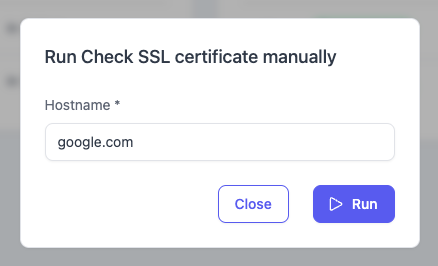
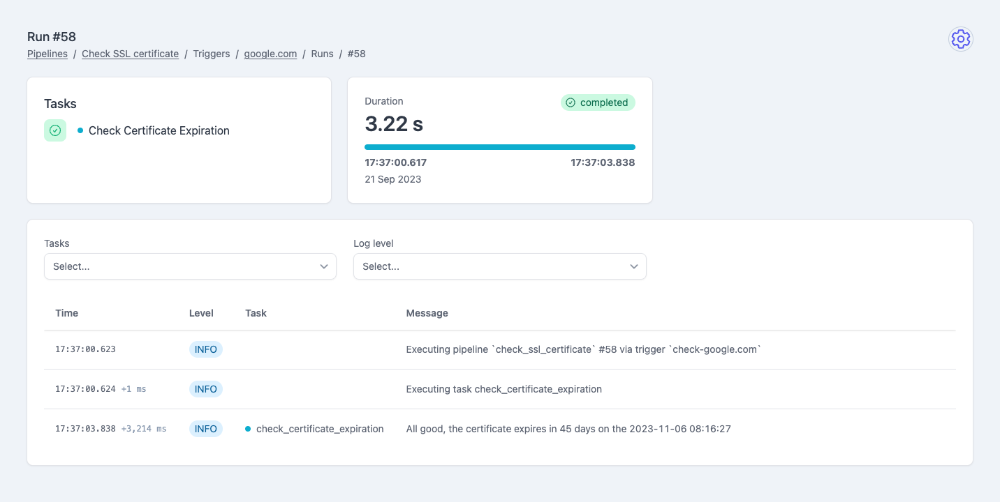

<section class="home">
  <h1>Features</h1>

  <article>
    <i>⏰</i>
    <h2>Task scheduling</h2>
    
Based on <a href="https://github.com/agronholm/apscheduler">APScheduler</a>, it supports Interval, Cron and Date triggers

  </article>

  <article class="large">
    

      <i>👩‍💻🐍</i>
      <h2>Python pipelines</h2>
      
Define pipelines and tasks in pure Python: if you can write a function, you can write a pipeline

    

    
  </article>

  <article class="large" style="grid-column: span 2 / span 1;">
    

      <i>🎛️</i>
      <h2>Parametrized pipelines</h2>
      
Use <a href="https://docs.pydantic.dev/">Pydantic</a> to define parameters,
       and get a nice web form to run your pipelines

    

    
  </article>

  <article>
    <i>👉</i>
    <h2>Manual runs</h2>
    
Run pipelines manually from the web UI, just click the button

  </article>

  <article>
    <i>💻</i>
    <h2>Built-in Web interface</h2>
    
No HTML/JS/CSS coding required

  </article>

  <article class="large" style="grid-row: span 2;">
    

      <i>🔍</i>
      <h2>Debugging</h2>
      
Explore logs and output data

    

    
  </article>

  <article>
    <i>🔐</i>
    <h2>Secured</h2>
    
Optional OAuth2 authentication

  </article>

  <article class="large">
    

      <i>💣</i>
      <h2>REST API</h2>
      
For advanced integrations use the REST API

    

    

      POST
      https://plombery.com/api/pipelines/run
    

  </article>

  <article>
    <i>📩</i>
    <h2>Monitoring</h2>
    
Get alerted if something goes wrong

  </article>

</section>
