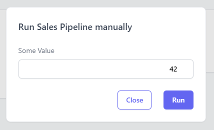

A pipeline is a list of tasks that are executed sequentially.

To declare a pipeline just call the function `register_pipeline`,
the only 2 mandatory fields are `id` and `tasks`:

```py
from plombery import register_pipeline, task

class InputParams(BaseModel):
  some_value: int

@task
def get_sales_data():
  pass

register_pipeline(
    # (required) the id identifies the pipeline univocally
    id="sales_pipeline_2345",
    # (required) the list of tasks to execute
    tasks=[get_sales_data],
    # This pipeline is configurable via input parameters
    params=InputParams,
    # The name is optional, if absent it would be generated from the ID
    name="Sales pipeline",
    description="""This is a very useless pipeline""",
    # Triggers with schedules
    triggers=[
        Trigger(
            id="daily",
            name="Daily",
            description="Run the pipeline every day",
            # the input params value for this specific trigger
            params=InputParams(some_value=2),
            schedule=IntervalTrigger(
                days=1,
            ),
        )
    ],
)
```

## Parameters

A pipeline is configurable if it declares some input parameters in the registration
via the `params` argument:

```py
register_pipeline(
  # ...
  params=InputParams
)
```

The `InputParams` is a [Pydantic Model](https://docs.pydantic.dev/latest/usage/models/):

```py
class InputParams(BaseModel):
  some_value: int
```

If the pipeline has input parameters, when you click the manual run button,
the dialog will present a form to let you customize the input parameters:

<figure markdown>
  
  <figcaption>Manual run with parameters</figcaption>
</figure>

The input form in the dialog is created automatically thanks to the Pydantic's
`BaseModel` that you declared in the pipeline.

Parameters are configurable also when you run a pipeline via the HTTP trigger,
just pass the parameters as JSON body in the HTTP request.
