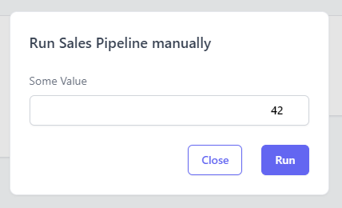

A pipeline is a graph of tasks: each task declares which tasks must run before
it, and Plombery runs them in that order, in parallel whenever the graph allows
it. The graph must be acyclic, and Plombery refuses to register a pipeline that
contains a cycle.

## Declaring the graph

The recommended way to build a pipeline is the `Pipeline` context manager: every
task defined inside it is added to the pipeline automatically, dependencies are
declared with the `>>` operator, and the pipeline registers itself with Plombery
when the block ends — so importing the file that defines it is all it takes.

```py
from plombery import Pipeline, task

with Pipeline(id="sales_pipeline") as pipeline:
    @task
    def extract():
        return [1, 2, 3]

    @task
    def transform(extract):
        return [value * 2 for value in extract]

    @task
    def notify(extract):
        ...

    # transform and notify both depend on extract, and run in parallel
    extract >> [transform, notify]
```

`a >> b` reads "a runs before b". The reverse operator is also available, so
`b << a` means the same thing. A task can depend on several tasks, and several
tasks can depend on it:

```py
extract >> transform >> load
extract >> notify
```

!!! warning "Dependencies are explicit"

    Defining tasks one after the other is not enough: two tasks with no `>>`
    between them have no relationship and will run at the same time. This is a
    breaking change from the versions of Plombery where `tasks=[a, b, c]` meant
    "run a, then b, then c".

A task doesn't have to be defined inside the `with Pipeline()` block: only the
dependency declarations do. This keeps the block itself short when a task's
body is long, or when the same function is easier to read at module level:

```py
@task
def extract():
    return [1, 2, 3]

@task
def transform(extract):
    return [value * 2 for value in extract]

with Pipeline(id="sales_pipeline") as pipeline:
    extract >> transform
```

### Naming an upstream task explicitly

By default, an argument's value comes from the upstream task whose id matches
the argument's name — `transform(extract)` above works because the argument is
called `extract`. Renaming either one silently breaks this, since nothing
checks that an argument name still matches a real task.

`OutputOf(task)` binds an argument to a specific task's output instead, so the
argument is free to have any name:

```py
@task
def fetch_data() -> list[dict]:
    ...

@task
def process(data: list[dict] = OutputOf(fetch_data)):
    ...

fetch_data >> process
```

The type is written twice — once on `fetch_data`, once on `process` — but that
duplication is checked, not just cosmetic: a type checker flags it if the two
disagree, because `OutputOf` is declared to return `fetch_data`'s own return
type. `OutputOf` only binds the data, though: it never creates the dependency
by itself, so `fetch_data >> process` (or `<<`) still has to be there. Leaving
it out is a validation error when the pipeline is built, naming the missing
line to add.

## Fan-out: dynamic task mapping

A task can be run once per item of the collection returned by an upstream task,
which is useful to process a list of files, accounts or hosts in parallel:

```py
from plombery import MappingMode, Pipeline, task

with Pipeline(id="hosts"):
    @task
    def get_hosts():
        return ["a.example.com", "b.example.com"]

    @task(mapping_mode=MappingMode.FAN_OUT, map_upstream_id="get_hosts")
    def check(get_hosts):
        # runs once per host, receiving a single host
        ...

    get_hosts >> check
```

`MappingMode.FAN_OUT` splits the upstream collection and gives one item to each
instance. `MappingMode.CHAINED_FAN_OUT` keeps the mapping going: the task runs
once per instance of the upstream mapped task, inheriting its index, so a chain
of mapped tasks processes one item at a time end to end.

If the upstream task of a fan-out doesn't return a collection, the run fails.

### When one branch fails

By default a failure stops the pipeline from scheduling any further task, and
every task that will no longer run is recorded as `cancelled`, so the run shows
where the DAG stopped instead of leaving a gap.

When the branches of a fan-out are independent of each other — one per input
file, one per record — that default throws away work that had already
succeeded. Set `fail_fast=False` and only the failed branch is dropped:

```python
with Pipeline(id="import_files", fail_fast=False) as pipeline:

    @task
    def list_files():
        return ["a.csv", "b.csv", "c.csv"]

    @task(mapping_mode=MappingMode.FAN_OUT, map_upstream_id="list_files")
    def parse(list_files):
        return read(list_files)

    @task(mapping_mode=MappingMode.CHAINED_FAN_OUT, map_upstream_id="parse")
    def store(parse):
        write_to_warehouse(parse)

    list_files >> parse >> store
```

If `b.csv` is corrupt, `a.csv` and `c.csv` are still stored, and only the
instance that failed and its own downstream instance are left out.

The run itself still ends as `failed` either way: something didn't get through.

## Registering a pipeline

A pipeline built with the `Pipeline` context manager registers itself when the
`with` block ends: nothing else to call.

```py
from plombery import Pipeline, task

with Pipeline(id="sales_pipeline") as pipeline:
    @task
    def get_sales_data():
        ...
# registered here, at the end of the block
```

To build a pipeline without registering it — for a test, or to register it
later — pass `auto_register=False`, then register it explicitly with
`register_pipeline` when you're ready:

```py
from plombery import Pipeline, register_pipeline, task

with Pipeline(id="sales_pipeline", auto_register=False) as pipeline:
    @task
    def get_sales_data():
        ...

register_pipeline(pipeline)
```

`register_pipeline` also accepts a pipeline's parts directly, without the
context manager — a flat alternative useful when a pipeline has a single task
and the graph itself needs no `>>`:

```py
from apscheduler.triggers.interval import IntervalTrigger
from plombery import register_pipeline, task, Trigger

@task
def get_sales_data():
    ...

register_pipeline(
    # (required) the id identifies the pipeline univocally
    id="sales_pipeline",
    # (required) the list of tasks to execute
    tasks=[get_sales_data],
    # The name is optional, if absent it would be generated from the ID
    name="Sales pipeline",
    description="Aggregate sales activity from all stores across the country",
    # Triggers with schedules
    triggers=[
        Trigger(
            id="daily",
            name="Daily",
            description="Run the pipeline every day",
            schedule=IntervalTrigger(days=1),
        )
    ],
)
```

The `params` argument, covered next, is accepted by every form.

## Parameters

A pipeline is configurable if it declares input parameters via the `params`
argument, a [Pydantic model](https://docs.pydantic.dev/latest/usage/models/):

```py
from pydantic import BaseModel
from plombery import Pipeline, task


class InputParams(BaseModel):
    some_value: int


with Pipeline(id="sales_pipeline", params=InputParams) as pipeline:
    @task
    def get_sales_data(params: InputParams):
        return params.some_value
```

The flat form takes the same argument:

```py
register_pipeline(
    id="sales_pipeline",
    tasks=[get_sales_data],
    params=InputParams,
)
```

If the pipeline has input parameters, when you click the manual run button,
the dialog will present a form to let you customize the input parameters:

<figure markdown>
  
  <figcaption>Manual run with parameters</figcaption>
</figure>

The input form in the dialog is created automatically thanks to the Pydantic's
`BaseModel` that you declared in the pipeline.

Parameters are configurable also when you run a pipeline via the HTTP trigger,
just pass the parameters as JSON body in the HTTP request.
