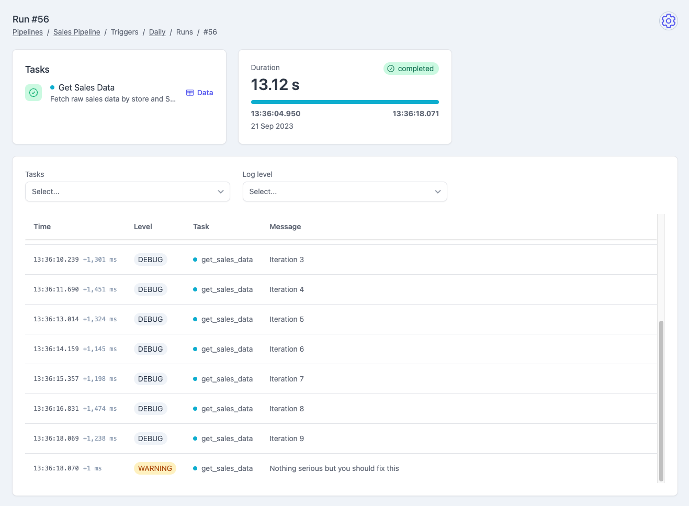

A task is just a regular Python function decorated with the `task` decorator,
the functions can be also `async`, Plombery will take care of everything:

```py
@task
def sync_task():
  pass

@task
async def async_task():
  pass
```

Tasks belong to a pipeline, and the simplest way to declare both is the
`Pipeline` context manager, which collects every task defined inside it:

```py
with Pipeline(id="my_pipeline") as pipeline:
  @task
  def sync_task():
    pass

  @task
  async def async_task(sync_task):
    pass

  sync_task >> async_task
```

!!! warning "Listing tasks is not enough to order them"

    Tasks with no `>>` between them are independent and run at the same time.
    See [Pipelines](pipelines.md) for how the graph is declared.

## Input parameters

If the pipeline declares input parameters:

```py
class InputParams(BaseModel):
  some_value: int

register_pipeline(
  # ...
  params=InputParams
)
```

then the task function will receive those input parameters
via the `params` argument:

```py
@task
async def my_task(params: InputParams):
  result = params.some_value + 8
```

## Output data

The return value of a task is its output data, and it is passed to the tasks
downstream of it. A task receives that data by declaring **an argument named
after the upstream task**:

```py
with Pipeline(id="my_pipeline"):
  @task
  def extract():
    return 1

  @task
  def transform(extract):
    # extract = 1, the return value of the `extract` task
    return extract + 1

  @task
  def load(extract, transform):
    # extract = 1, transform = 2
    return extract + transform

  extract >> transform >> load
  extract >> load
```

!!! warning "Argument names are meaningful"

    An argument is resolved by *name*, not by position: `def transform(extract)`
    works because there is an upstream task whose ID is `extract`. Renaming the
    argument, or forgetting to declare the dependency with `>>`, means the task
    won't receive the data.

    To free the argument from having to match the task's name, use
    [`OutputOf`](pipelines.md#naming-an-upstream-task-explicitly) instead.

An argument that doesn't name an upstream task and declares a default value is
treated as a plain argument of the function, and keeps its default:

```py
@task
def transform(extract, factor=10):
  # factor is not a task, so it keeps its default value
  return extract * factor
```

### Gathering the output of a mapped task

When a task is downstream of a [fan-out](pipelines.md#fan-out-dynamic-task-mapping)
task but is not mapped itself, it receives the output of **every** instance as a
list, ordered by map index:

```py
with Pipeline(id="fan_in"):
  @task
  def get_ids():
    return [1, 2, 3]

  @task(mapping_mode=MappingMode.FAN_OUT, map_upstream_id="get_ids")
  def fetch(get_ids):
    return get_ids * 10

  @task
  def summarize(fetch):
    # fetch = [10, 20, 30]
    return sum(fetch)

  get_ids >> fetch >> summarize
```

## Secrets

A task that needs a credential — a database password, an API key — declares
it with `BaseSecrets` rather than reading it with a plain `os.getenv`. See
[Secrets](secrets.md) for how to declare and use one.

## Logging

Plombery collects automatically pipelines logs and shows them on the UI:

<figure markdown>
  
  <figcaption>Pipeline run logs</figcaption>
</figure>

To use this feature, you need to use a plombery's logger simply calling
the `get_logger` function:

```py
from plombery import get_logger

@task
def my_task():
  logger = get_logger()
  logger.debug("Hey greetings!")
```

!!! warning

    `get_logger` is a special function that only works inside tasks functions:
    don't call it outside of those functions as it won't work!
    ```py
    # ❌ Don't do this
    logger = get_logger()
    def my_task():
      logger.debug("Hey greetings!")
    ```
